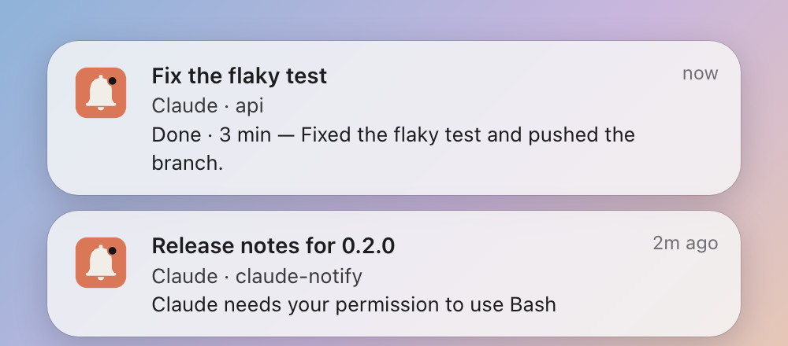
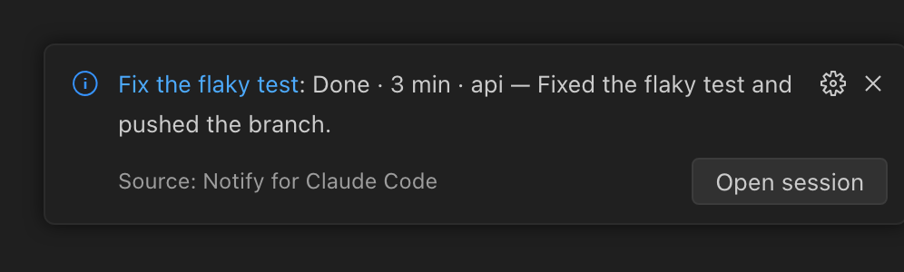
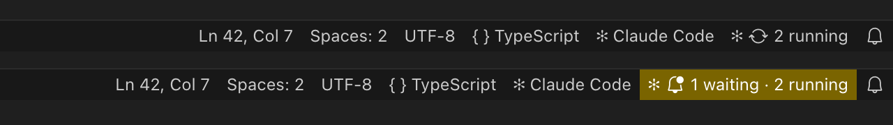
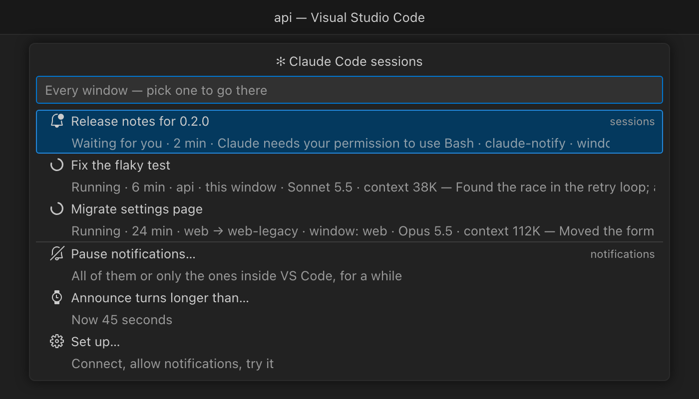

# Notify for Claude Code

**Run several Claude Code sessions. Keep every one of them under control.**

Claude works while you do something else. Notify for Claude Code tells you the moment a
session finishes or needs you — a permission, a question — and one click takes you straight
back to it, in whichever window it lives.



- **On time.** A notification the moment a session is done or waiting, with what it asks or
  how its answer began.
- **One click back.** Straight to that session, where it already is.
- **Everything in view.** *✻* in the status bar counts what is running and what is waiting,
  across every window.

## Why

Claude Code does not signal a session you are not looking at. The Claude Code extension
puts a badge on its session list, but only while that window is in front of you. With
three sessions running, you end up checking each one by hand.

## What you get

### A notification when it is your turn

| When | Notification |
| --- | --- |
| A session finished | *Done · N min* |
| A session stopped with an error | *Stopped with an error* |
| A session wants a permission or an answer | the actual request text |

Each one is titled with the session's name — the one Claude Code shows on its tab — with
the project underneath, and carries how the model's last answer began: *Done · 12 min — Fixed
the flaky test and pushed the branch.* Enough to know what happened without switching.

- **Click to switch.** The click brings that session's window to the front with the session
  open — in its tab, or in the Claude sidebar if that is where you keep it. It never opens a
  second view of a session.
- **A short turn stays quiet.** If a turn took less than 45 seconds you were watching it
  arrive, so nothing fires. Adjustable.
- **One notification per event, and per session.** Claude Code also reports a session as
  "waiting for your input" some minutes after a turn; that is the same news as *Done*, so it
  is not shown again and does not light the status bar. A newer notification replaces the
  older one, and going back to a session clears its old one — nothing stale is left in the
  stack for a click to land on by mistake.

### The same, inside VS Code



The window that holds the session shows it too. Its *Open session* button, or the session's
name in it, does what a click on the system notification does.

### Every session in view



*✻* in the status bar counts what is running and what is waiting across all your VS Code
windows, and lights up while a session waits for you. Click it for the full list:



| | |
| --- | --- |
| **who** | the session's title, the same one Claude Code shows |
| **where** | the project it was started in and which window has it — plus where it is working now, if it moved on to another repository |
| **state** | waiting for you — with what it is asking — or running, and for how long |
| **size** | model and how much context the session is carrying |

Pick one and its window comes to the front with that session open. A session that no window
has open — started in a terminal, or in a window you closed — is listed as such, and picking
it offers to open its folder instead of guessing a window. A notification for such a session
does nothing on click rather than open windows you did not ask for.

### Quiet when you need it

Pause for 15 minutes, an hour, three hours or until you resume — every notification, or only
the ones inside VS Code. A pause holds in every window, shows as a crossed-out bell in the
status bar, and sessions keep being counted meanwhile.

## Install

Search for **Notify for Claude Code** in the Extensions view, or run

```sh
code --install-extension rayz.claude-notify
```

It is on [Open VSX](https://open-vsx.org/extension/rayz/claude-notify) too. The setup page
opens by itself.

## Requirements

- **macOS 13 or later.** Windows and Linux are planned; this release installs only on macOS.
- The official **Claude Code** extension for VS Code.

That is all. The extension brings the rest: a small app of its own that shows the
notifications, and a runner that starts the notifier with VS Code's own runtime. No Node.js,
no Homebrew, nothing else to install.

## Setup

The first time it starts, Notify for Claude Code opens its setup page — *Notify for Claude
Code: Set up…* opens it again. Each step is one button:

1. **Connect to Claude Code.** Adds four hooks to `~/.claude/settings.json`; hooks are the
   only way Claude Code tells anyone about a session. Nothing else in the file changes.
2. **Allow notifications.** macOS asks once whether *Notify for Claude Code* may show
   notifications.
3. **Keep them on screen** — optional. With the *Persistent* style a notification stays until
   you deal with it; the step ticks itself once that is set.
4. **Try it.** Start a new Claude session — ones already open were started before the hooks —
   and give it something that takes longer than 45 seconds. A shorter turn finishes quietly,
   because you were watching it.

If something does not arrive, *Notify for Claude Code: Check that notifications work* names
what is missing.

## Commands

| Command | What it does |
| --- | --- |
| Notify for Claude Code: Go to a session | the list of every active session — the same as clicking the status bar |
| Notify for Claude Code: Set up… | the setup page: connect, allow notifications, try it |
| Notify for Claude Code: Allow notifications | asks macOS, as the setup page does |
| Notify for Claude Code: Open notification settings | this app's page in System Settings → Notifications |
| Notify for Claude Code: Send a test notification | one notification, to check it appears — it belongs to no session, so it has nothing to open |
| Notify for Claude Code: Check that notifications work | checks everything below and names what is broken |
| Notify for Claude Code: Turn notifications on or off | master switch |
| Notify for Claude Code: Pause notifications… | all of them or only the ones inside VS Code, for a while — also at the bottom of the session list |
| Notify for Claude Code: Resume notifications | lifts any pause |
| Notify for Claude Code: Add hooks to Claude Code settings | if you said "Not now" at first |
| Notify for Claude Code: Remove hooks from Claude Code settings | takes out only what it added |

## Settings

| Setting | Default | |
| --- | --- | --- |
| `claudeNotify.enabled` | `true` | master switch |
| `claudeNotify.minTurnSeconds` | `45` | shorter turns finish quietly; `0` announces every turn |
| `claudeNotify.events` | all | `done`, `error`, `waitingInput` |
| `claudeNotify.style` | `alert` | `alert` stays until answered, `banner` fades out |
| `claudeNotify.sound` | `true` | |
| `claudeNotify.editorNotifications` | `true` | the same notification inside the window that holds the session |
| `claudeNotify.statusBar` | `true` | running and waiting sessions in the status bar |

## How it works

Claude Code runs a small script on four events. The script times the turn, decides
whether it is worth a notification, and shows one. It runs with VS Code's own runtime,
started by `~/.claude/claude-notify/claude-notify`, so no Node.js is needed.

An extension cannot show a system notification itself — VS Code has no API for it — and
macOS gives every notification to an app: it shows that app's name and icon, and asks once
whether that app may notify. So the extension brings a small app of its own, *Notify for
Claude Code*, and keeps it at `~/.claude/claude-notify/`. The command a click should run is
stored inside the notification, and nothing stays behind waiting for an answer: macOS
relaunches the app to deliver the click.

Each VS Code window's extension listens on a loopback port that only this machine can
reach, guarded by a random token, and records its port and workspace folders under
`~/.claude/claude-notify/links/`. On a click the script brings the window whose workspace
holds the session's folder to the front and asks it to focus the session; a session outside
every workspace goes to the window you used last.

The script also keeps one small file per active session under
`~/.claude/claude-notify/sessions/`, which every window reads for its status bar and list.
Whether a session is running is read from its transcript: a working session keeps writing
to it. The title and context size come from the end of that same file when you open the list,
since they change on every turn. The
extension does that through the Claude Code extension's own command, so VS Code's
confirmation prompt for external links never appears.

Nothing leaves your machine. There is no telemetry.

## Uninstalling

Uninstalling removes the hooks, the copied script, the notifying app and the link files.
VS Code runs that cleanup after the next restart.

## Known limits

- **Context is shown as a size, not a percentage.** The transcript rarely says how large the
  model's window is, and a guessed percentage would be worse than an honest number.
- **"Running" means the transcript is being written.** Hooks alone miss sessions that resume
  after an editor restart without a new prompt, and never hear about one killed mid-turn. A
  working session always writes its transcript, so that decides: silent for ten minutes, and
  a session that claimed to be running is taken off the list.

- **The focus command belongs to the Claude Code extension** and is not a documented API.
  If a future release renames it, clicks fall back to a `vscode://` link, which works
  after VS Code asks once.
- **Sessions in a plain terminal** have no tab to switch to. They still notify.
- **VS Code cannot take back a notification it has shown.** A newer one does not replace
  the older inside VS Code, and going back to the session does not clear it; old ones stay in
  the notification list until you clear them. Their button still opens the right session.

---

Notify for Claude Code is an independent project and is not affiliated with or endorsed by Anthropic.
